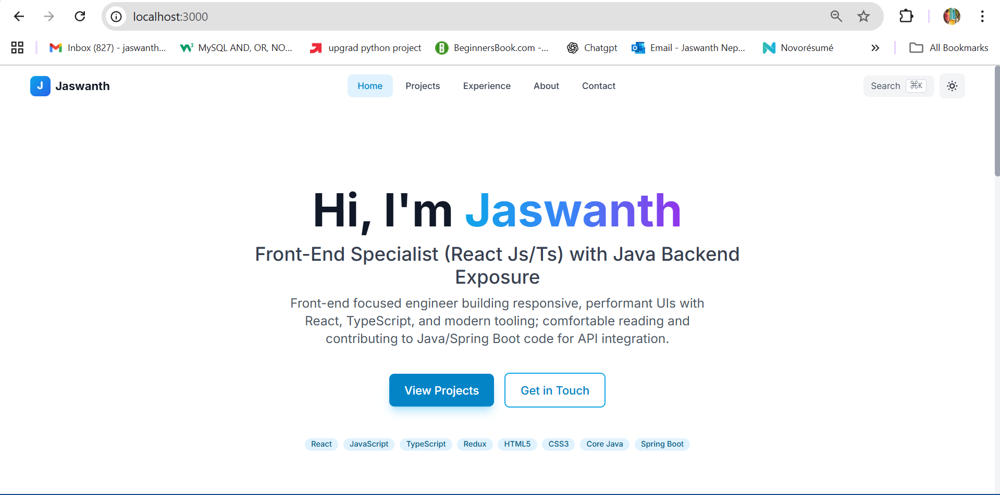

# Jaswanth Portfolio

<div align="center">

## Hi, I'm Jaswanth 👋

### Front-End Developer specialized in React, TypeScript, and Vite

I build responsive, high-performance web applications and enjoy turning design concepts into clean, maintainable code.

**Tech Stack:** React | Vite | TypeScript | Redux | Jest | Java (Spring Boot) | Git | Azure DevOps

   

</div>

---

## 🖼️ Portfolio Preview



A stunning, modern portfolio website featuring innovative UI patterns, smooth animations, and full accessibility compliance.

## ✨ Features

### 🎨 Innovative UI Design
- **Bento Grid Layout** - Modern dashboard-style home page
- **Spotlight Cards** - Interactive cards with cursor-following spotlight effect
- **Command Palette** - Quick navigation with ⌘K/Ctrl+K
- **Glassmorphism** - Beautiful glass effects throughout
- **Micro-interactions** - Delightful animations and transitions

### ⚡ Performance
- **Lighthouse Score 95+** - Optimized for performance
- **Code Splitting** - Route-based lazy loading
- **Optimized Animations** - Smooth 60fps animations
- **Fast Load Times** - Minimal bundle size

### ♿ Accessibility
- **WCAG AA+ Compliant** - Full accessibility support
- **Keyboard Navigation** - Complete keyboard support
- **Screen Reader Friendly** - Semantic HTML and ARIA labels
- **Reduced Motion Support** - Respects user preferences
- **Skip Links** - Quick navigation for screen readers

### 🎯 Key Features
- **Fully Responsive** - Mobile-first design
- **Dark/Light Mode** - System-aware theme switching
- **SEO Optimized** - Meta tags, sitemap, robots.txt
- **Type-Safe** - Full TypeScript coverage
- **Testing** - Vitest + React Testing Library
- **Data-Driven** - Easy content updates via `src/data/site.ts`

## 🚀 Quick Start

### Prerequisites
- Node.js 16+ and npm/yarn/pnpm

### Installation

```bash
# Clone the repository
git clone https://github.com/yourusername/portfolio.git

# Navigate to the project directory
cd portfolio

# Install dependencies
npm install --legacy-peer-deps

# Start the development server
npm run dev
```

Visit `http://localhost:3000` to see your portfolio in action!

## 📁 Project Structure

```
portfolio/
├── public/
│   ├── robots.txt
│   ├── sitemap.xml
│   └── assets/           # Add your images, resume, etc.
├── src/
│   ├── components/
│   │   ├── layout/       # Header, Footer, Layout
│   │   └── ui/           # Reusable UI components
│   ├── contexts/         # React contexts (Theme, CommandPalette)
│   ├── data/
│   │   └── site.ts       # All portfolio content (EDIT THIS!)
│   ├── hooks/            # Custom React hooks
│   ├── pages/            # Page components
│   ├── utils/            # Utility functions
│   ├── App.tsx           # Main app component
│   ├── main.tsx          # Entry point
│   └── index.css         # Global styles
├── .eslintrc.cjs         # ESLint configuration
├── .prettierrc           # Prettier configuration
├── tailwind.config.js    # Tailwind configuration
├── tsconfig.json         # TypeScript configuration
└── vite.config.ts        # Vite configuration
```

## ✏️ Customization

### Update Your Content

Edit `src/data/site.ts` to customize all content:

```typescript
const siteData: SiteData = {
  name: "Your Name",
  role: "Your Role",
  tagline: "Your tagline",
  email: "your.email@example.com",
  // ... more fields
}
```

### Add Your Assets

1. Add your resume to `public/assets/Resume.pdf`
2. Add project images to `public/assets/`
3. Update image paths in `site.ts`

### Customize Theme

Edit `tailwind.config.js` to change colors, fonts, etc.:

```javascript
theme: {
  extend: {
    colors: {
      primary: {
        // Your custom colors
      },
    },
  },
}
```

### Customize Components

All UI components are in `src/components/ui/`. Modify them to match your style.

## 🧪 Testing

```bash
# Run tests
npm run test

# Run tests with UI
npm run test:ui

# Run tests in watch mode
npm run test -- --watch
```

## 🔨 Building for Production

```bash
# Build the project
npm run build

# Preview the production build
npm run preview
```

The build output will be in the `dist/` directory, ready to deploy!

## 🌐 Deployment

### Deploy to Vercel

1. Install Vercel CLI: `npm i -g vercel`
2. Run: `vercel`
3. Follow the prompts

Or connect your GitHub repo to Vercel for automatic deployments.

### Deploy to Netlify

1. Build the project: `npm run build`
2. Drag & drop the `dist` folder to [Netlify Drop](https://app.netlify.com/drop)

Or connect your GitHub repo to Netlify for automatic deployments.

### Deploy to GitHub Pages

1. Update `vite.config.ts`:
   ```typescript
   export default defineConfig({
     base: '/your-repo-name/',
     // ...
   })
   ```

2. Build: `npm run build`

3. Deploy the `dist` folder to the `gh-pages` branch

## 🛠️ Tech Stack

- **Framework:** React 18
- **Build Tool:** Vite
- **Language:** TypeScript
- **Styling:** Tailwind CSS
- **Animations:** Framer Motion
- **Routing:** React Router
- **SEO:** React Helmet Async
- **Testing:** Vitest + React Testing Library
- **Linting:** ESLint + Prettier

## 📄 Scripts

- `npm run dev` - Start development server
- `npm run build` - Build for production
- `npm run preview` - Preview production build
- `npm run test` - Run tests
- `npm run test:ui` - Run tests with UI
- `npm run lint` - Lint code

## 🎨 Features Showcase

### Command Palette (⌘K)
Press `⌘K` (Mac) or `Ctrl+K` (Windows/Linux) to open the command palette for quick navigation.

### Bento Grid
The home page features a modern Bento Grid layout showcasing your best work.

### Spotlight Cards
Project cards feature an interactive spotlight effect that follows your cursor.

### Timeline
The experience page uses a beautiful timeline component to display your career journey.

### Theme Toggle
One-click theme switching with system preference detection.

## ♿ Accessibility Features

- Semantic HTML5 markup
- ARIA labels and roles
- Keyboard navigation support
- Skip-to-content link
- Focus visible indicators
- Reduced motion support
- High contrast support
- Screen reader optimized

## 🐛 Known Issues

None at the moment! 🎉

## 📝 License

MIT License - feel free to use this for your own portfolio!

## 🤝 Contributing

Contributions, issues, and feature requests are welcome!

## 💬 Contact

- Email: Jaswanth9841@gmail.com
- LinkedIn: [Jaswanth Neppolian](https://www.linkedin.com/in/jaswanthneppolian)
- GitHub: [Jaswanth9841](https://github.com/Jaswanth9841)
- Phone: +91 9551344553

## ⭐ Show Your Support

Give a ⭐️ if you like this project!

---

Built with ❤️ by Jaswanth

